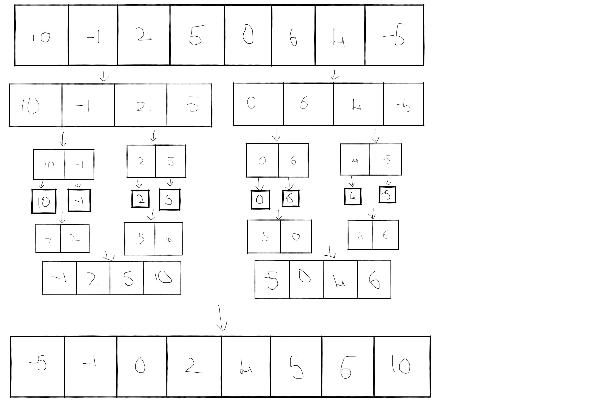

Merge Sort

Started with if condition which says not needed to sort the array if the array only has one element or if it is empty. And divided the array in half and figuredout the mid point. And divided the array into left and right. 
Used recursion to combine the left and right. And wrote a function to merged two arrays left and right. and then need to concat because there will be one element remaining from either left or the right. 

