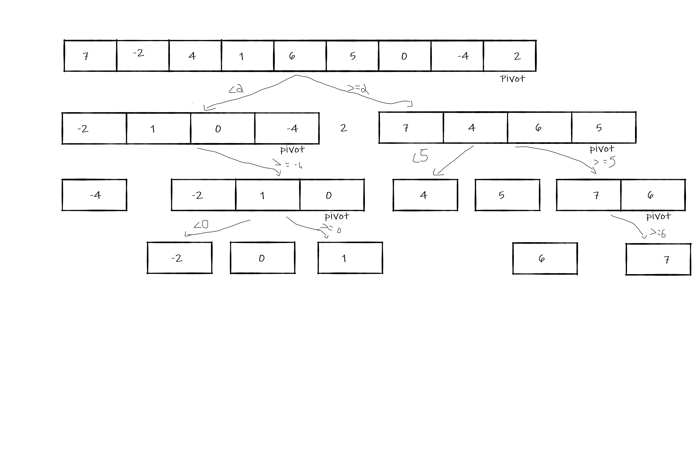

Quick Sort

Select an element of the array. This element is generally called the pivot. Most often this element is either the first or the last element in the array.
Then, rearrange the elements of the array so that all the elements to the left of the pivot are smaller than the pivot and all the elements to the right are greater than the pivot. The step is called partitioning. If an element is equal to the pivot, it doesn't matter on which side it goes.
Repeat this process individually for the left and right side of the pivot, until the array is sorted.

