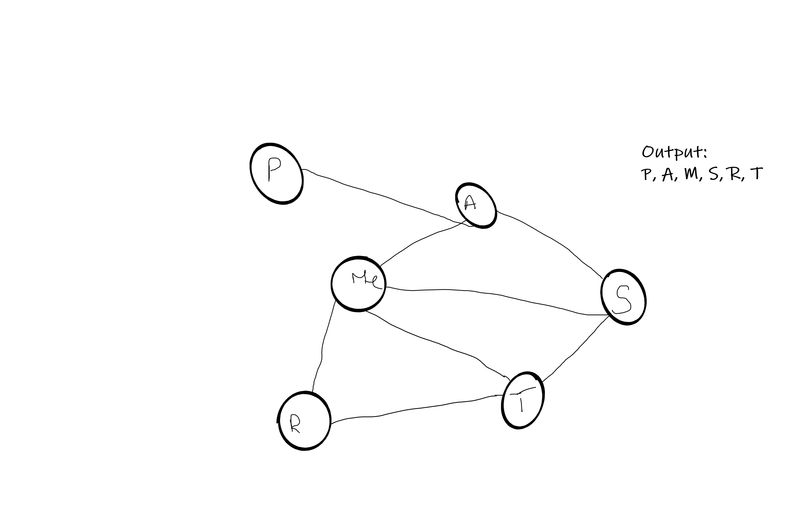

# Challenge Summary
BreadthFirstSearch

## Challenge Description.
Extend your graph object with a breadth-first traversal method that accepts a starting node. Without utilizing any of the built-in methods available to your language, return a collection of nodes in the order they were visited. Display the collection.

## Approach & Efficiency
Written test first and then the code. Also drew out a whiteboard for each step then used the algorithm and then code.

## Solution
