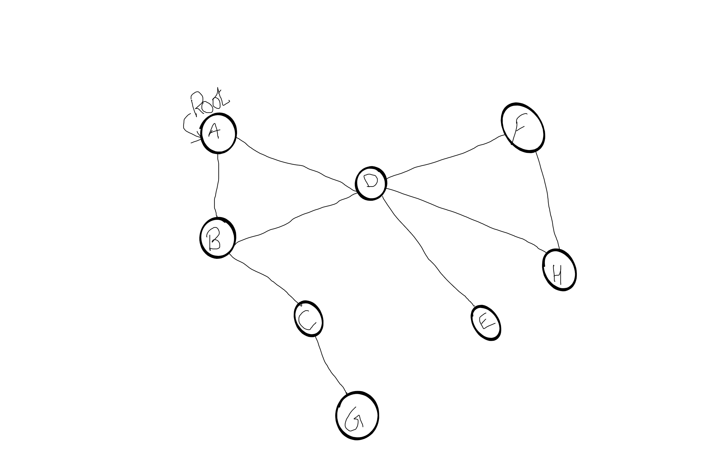

# Challenge Summary
depthFirst

## Challenge Description.
Create a function that accepts an adjacency list as a graph, and conducts a depth first traversal. Without utilizing any of the built-in methods available to your language, return a collection of nodes in their pre-order depth-first traversal order.

## Approach & Efficiency
Written test first and then the code. Also drew out a whiteboard for each step then used the algorithm and then code.

## Solution
