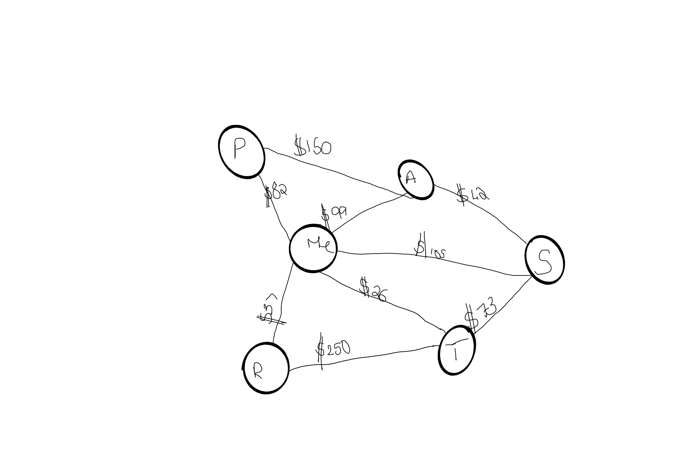

# Challenge Summary
getEdge

## Challenge Description.
Write a function based on the specifications above, which takes in a graph, and an array of city names. Without utilizing any of the built-in methods available to your language, return whether the full trip is possible with direct flights, and how much it would cost.

## Approach & Efficiency
Written test first and then the code. Also drew out a whiteboard for each step then used the algorithm and then code.

## Solution
