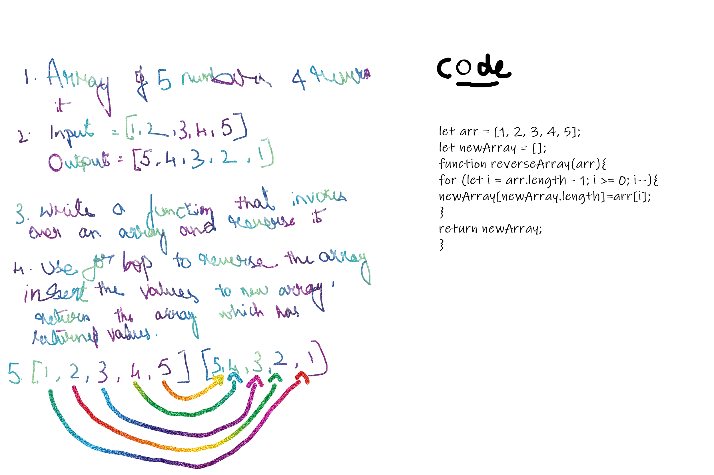

# Whiteboarding

### Reverse an Array
Code Challenge to Reverse an Array

### Challenge
Write a function called reverseArray which takes an array as an argument. Without utilizing any of the built-in methods available to your language, return an array with elements in reversed order.

### Approach & Efficiency
Used for loop to reverse the array, iserted the values to new array and returned the array which has returned values.

### Solution

