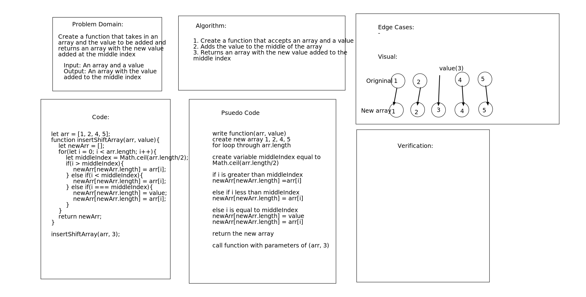

### Shift an Array
Code Challenge to Shift an Array

### Challenge
Write a function called insertShiftArray which takes in an array and the value to be added. Without utilizing any of the built-in methods available to your language, return an array with the new value added at the middle index.

### Approach & Efficiency
Used Math.ceil to get the middle Index of the array, iserted the values to new array and returned the array which has returned values.

### Solution
