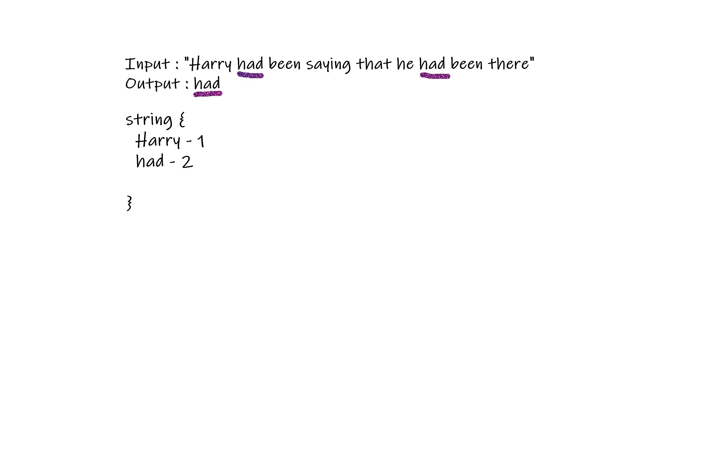

# Challenge Summary
First repeated word in a book.

## Challenge Description.
- Write a function that accepts a lengthy string parameter.
- Without utilizing any of the built-in library methods available to your language, return the first word to occur more than once in that provided string.

## Approach & Efficiency
Written test first and then the code. Also drew out a whiteboard for each step then used the algorithm and then code.

## Solution
